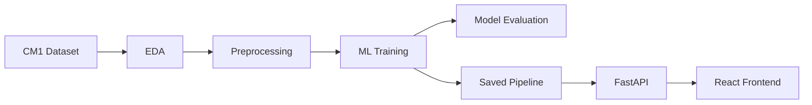

# Software Defect Prediction & QA Analytics System

### Using Machine Learning

## Project Overview

This student portfolio project, **Software Defect Prediction & QA Analytics System Using Machine Learning**, demonstrates Data Analysis, Quality Assurance analytics, Machine Learning, Python, FastAPI, React, and REST API development. It applies software metrics and supervised machine learning to estimate whether a software module is defective, combining exploratory analysis, model comparison, a saved scikit-learn pipeline, a FastAPI prediction service, and a React/Vite interface. It is a prototype and is not presented as a production deployment.

The application is a prototype for QA decision support. The Power BI dashboard folder is currently a placeholder; no Power BI report is included.

## Problem Statement

Defects discovered late in development can increase rework and testing effort. A module-level risk estimate can help QA teams prioritize review, but defect datasets are often imbalanced, so a high accuracy score alone can hide missed defective modules.

## Objectives

- Explore the CM1 software metrics dataset and document data quality.
- Compare four classifiers using a repeatable, leakage-aware training workflow.
- Evaluate the selected model with metrics suited to an imbalanced target.
- Package preprocessing and classification together for consistent API predictions.
- Provide a simple browser interface for entering module metrics and viewing risk.

## Key Features

- EDA of the dataset, missing values, duplicates, target balance, metric distributions, and correlations.
- Duplicate removal before the stratified train/test split.
- Numeric and categorical preprocessing within sklearn pipelines.
- Class-imbalance handling using class weighting or XGBoost's positive-class weight.
- Selection across four classifiers using stratified 5-fold training cross-validation and F1-score.
- FastAPI health and prediction endpoints with request validation and defective-class probability.
- Responsive React form using the saved model's actual 21 feature names.

## Dataset

The project uses `data/cm1.csv`, with `defects` as the target. The file currently contains:

| Dataset detail | Value |
| --- | ---: |
| Original rows | 498 |
| Columns, including target | 22 |
| Non-defective modules | 449 |
| Defective modules | 49 |
| Defective share | Approximately 9.8% |

There are 21 input metrics and one target column. The data is imbalanced: defective modules are the minority class. Exact duplicate rows (56) are removed before splitting so identical records cannot appear in both train and test partitions. The original CSV is not changed by the training script.

The CM1 dataset is included locally for development. Before redistributing the dataset publicly, verify the dataset's applicable license and redistribution terms.

## Technology Stack

- Python, Jupyter Notebook, pandas, NumPy
- Matplotlib and Seaborn for EDA and evaluation plots
- scikit-learn and XGBoost for preprocessing, model training, and evaluation
- joblib for saving and loading the complete pipeline
- FastAPI, Pydantic, and Uvicorn for the HTTP API
- React, Vite, and Lucide React for the frontend
- Power BI is a planned extension; only the `dashboard/` placeholder exists currently

## System Architecture



## Machine Learning Workflow

1. Load `data/cm1.csv` and separate `defects` from the predictors.
2. Remove exact duplicate rows and exclude identifier-like columns if present.
3. Split with `test_size=0.2`, `stratify=y`, and `random_state=42`.
4. Fit imputation, scaling, and categorical encoding only inside model pipelines, so preprocessing is fitted on training folds/data rather than the holdout.
5. Address the minority defective class using balanced class weights for Logistic Regression, Decision Tree, and Random Forest, and `scale_pos_weight` for XGBoost.
6. Compare candidate models using stratified 5-fold cross-validation on the training split, selecting the highest mean F1-score.
7. Evaluate the selected workflow on the held-out test split and save the complete preprocessing-plus-model pipeline to `models/defect_model.pkl`.

## Models Used

- Logistic Regression
- Decision Tree
- Random Forest
- XGBoost

## Model Evaluation

The evaluation notebook reports accuracy, precision, recall, F1-score, and ROC-AUC, along with confusion matrices, ROC curves, and tree-based feature importance where supported. The holdout is not used for preprocessing fitting or model selection.

Recall matters because a false negative is a defective module that the model fails to flag. Precision gives context on how many flagged modules are actually defective, and F1-score balances precision and recall. These measures are important alongside accuracy because only about 9.8% of the original dataset is defective.

## Results

The selected model was **Logistic Regression**, chosen using stratified 5-fold cross-validation on the training split based on F1-score. Its verified held-out evaluation results are:

| Metric | Result |
| --- | ---: |
| Accuracy | 76.4% |
| Precision | 29.6% |
| Recall | 80.0% |
| F1-score | 43.2% |
| ROC-AUC | 0.842 |

The recall/precision trade-off should be considered in a QA context; these results are measurements on this dataset's holdout, not a guarantee of future performance.

## FastAPI Backend

The backend loads `models/defect_model.pkl`, validates the 21 numeric feature values, and returns the predicted class, probability for the defective class, and risk band. Risk bands are Low below 30%, Medium from 30% through 60%, and High above 60%.

## React Frontend

The frontend provides numeric fields for the model's actual feature names, a prediction action with loading and error states, and a result view for the predicted class, defect probability, and risk level. It sends requests to `http://127.0.0.1:8000/predict`.

## Project Structure

```text
software-defect-prediction/
├── backend/
│   ├── __init__.py
│   ├── app.py
│   └── schemas.py
├── dashboard/
│   └── .gitkeep              # Placeholder for future Power BI work
├── data/
│   ├── .gitkeep
│   └── cm1.csv
├── frontend/
│   ├── index.html
│   ├── package.json
│   ├── package-lock.json
│   └── src/
│       ├── App.jsx
│       ├── main.jsx
│       └── styles.css
├── models/
│   ├── .gitkeep
│   └── defect_model.pkl      # Generated locally; ignored by Git
├── notebooks/
│   ├── 01_data_analysis.ipynb
│   ├── 02_eda.ipynb          # Placeholder
│   ├── 03_preprocessing.ipynb # Placeholder
│   ├── 04_model_training.ipynb
│   └── 05_model_evaluation.ipynb
├── src/
│   ├── __init__.py
│   ├── evaluation.py         # Placeholder
│   ├── predict.py            # Placeholder
│   ├── preprocessing.py      # Placeholder
│   └── train_model.py
├── tests/
│   ├── __init__.py
│   ├── test_api.py           # Placeholder
│   └── test_preprocessing.py # Placeholder
├── .gitignore
├── LICENSE
├── README.md
└── requirements.txt
```

The annotated notebooks and source/test files are explicitly identified as placeholders above; they are not completed features. The `models/` ignore rules exclude the generated pickle file from Git, so recreate it locally by running `python src/train_model.py` before launching the API.

## Installation

Prerequisites: Python 3.10 or newer and Node.js/npm. From the repository root, create and activate a virtual environment, then install Python dependencies:

```bash
python -m venv venv
```

Windows PowerShell:

```powershell
venv\Scripts\Activate.ps1
```

macOS/Linux:

```bash
source venv/bin/activate
```

Install Python packages:

```bash
python -m pip install -r requirements.txt
```

Install frontend packages:

```bash
cd frontend
npm install
cd ..
```

## How to Run

Run these from the repository root, using separate terminals for the backend and frontend:

1. Train the model and create the ignored local pipeline file:

	```bash
	python src/train_model.py
	```

2. Start the backend:

	```bash
	uvicorn backend.app:app --reload --port 8000
	```

3. Start the frontend in another terminal:

	```bash
	cd frontend
	npm run dev
	```

Open the frontend at `http://localhost:5173/`. The API must be running for predictions to work.

## API Endpoints

| Method | Path | Purpose |
| --- | --- | --- |
| `GET` | `/health` | Returns service health status. |
| `POST` | `/predict` | Accepts all 21 numeric model features and returns a prediction, defective-class probability, and risk level. |

The request JSON keys must match the saved model's feature names: `loc`, `v(g)`, `ev(g)`, `iv(g)`, `n`, `v`, `l`, `d`, `i`, `e`, `b`, `t`, `lOCode`, `lOComment`, `lOBlank`, `locCodeAndComment`, `uniq_Op`, `uniq_Opnd`, `total_Op`, `total_Opnd`, and `branchCount`. All are required numeric values; unknown fields are rejected.

When the backend is running, interactive Swagger documentation is available at [http://127.0.0.1:8000/docs](http://127.0.0.1:8000/docs).

## Example Prediction

Example response format:

```json
{
  "prediction": true,
  "defect_probability": 0.9948304842895042,
  "risk_level": "High"
}
```

This is one response observed for a single CM1 row, included only to illustrate the API response shape. It is not a general model-performance result; see the evaluation table above for the held-out metrics.

## Limitations

- The model was evaluated on a small, imbalanced dataset; results may not generalize to other projects, languages, or development processes.
- The prediction depends on the supplied software metric values and does not explain the underlying causes of defects.
- The current web form requires all 21 model inputs to be entered manually.
- The model pickle is generated locally and is not committed, so the dataset and training dependencies are needed to reproduce it.
- No Power BI report, automated test suite, database, or production deployment is included yet.
- This system is a QA decision-support tool and does not replace professional software testing.

## Future Improvements

- Build a Power BI QA dashboard.
- Tune model parameters and decision thresholds using a documented validation strategy.
- Add explainable AI, such as SHAP, to help interpret model outputs.
- Integrate a database for prediction history and QA analytics.
- Deploy the service to a cloud platform with appropriate operational safeguards.
- Add automated backend and frontend tests and continuous integration/continuous delivery (CI/CD).
- Evaluate on larger and more diverse software defect datasets.

## Skills Demonstrated

Data cleaning and EDA; imbalanced classification; sklearn pipelines and leakage-aware evaluation; model comparison; API and schema design; React form development; and documenting a reproducible, end-to-end analytics project.

## Author

**Upeksha Jayasinghe**

GitHub: [https://github.com/Upeksha-Jayasinghe](https://github.com/Upeksha-Jayasinghe)  
LinkedIn: [https://www.linkedin.com/in/upeksha-jayasinghe-687894367/](https://www.linkedin.com/in/upeksha-jayasinghe-687894367/)

License: To be selected.
